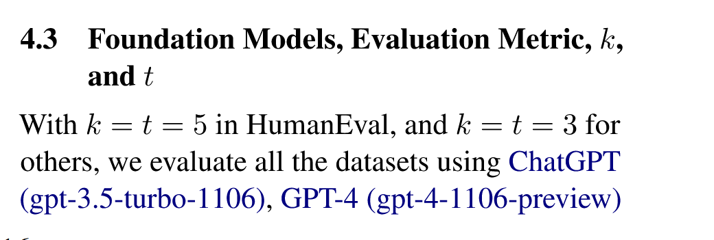
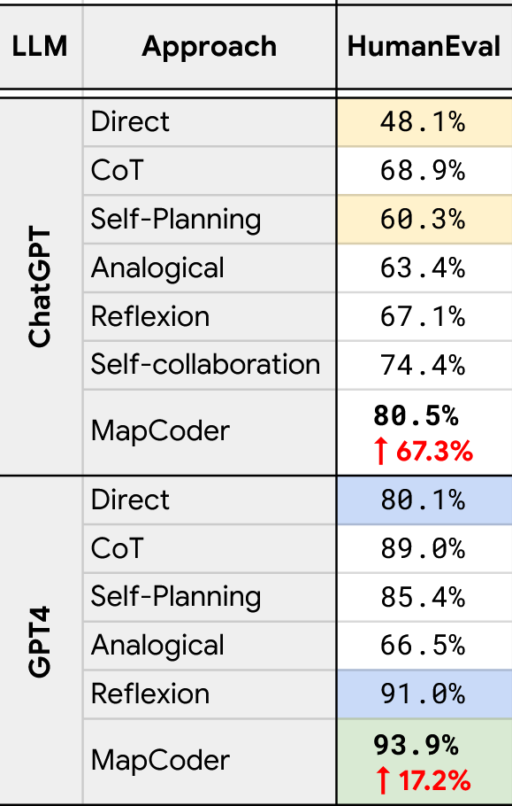
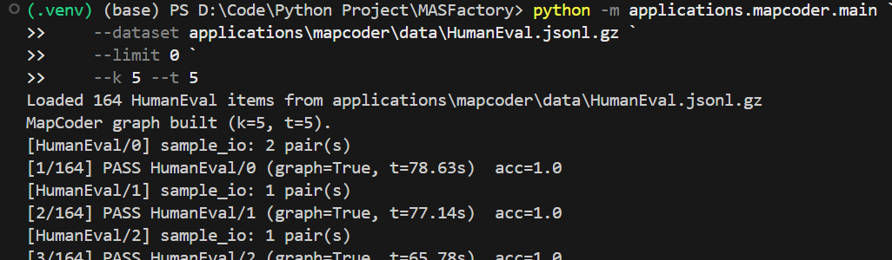
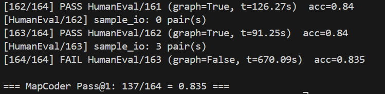

# MapCoder × MASFactory

Self-contained reproduction of [MapCoder: Multi-Agent Code Generation for Competitive Problem Solving](http://arxiv.org/abs/2405.11403) (ACL 2024) on top of MASFactory.

## Workflow

```
entry --(problem, language, k)--> Retrieval (Agent)
   --(content)--> RetrievalParser (CustomNode)
   --(exemplars, algorithm, ...)--> PlanFanout (Loop, k iters)
       inner: ExemplarPicker -> PlanGen -> ConfidenceEval -> controller
   --(plan_buffer, ...)--> PlanSorter (CustomNode)
   --(sorted_plans, ...)--> PlanIteration (Loop, up to k iters)
       inner: PlanPicker -> Coding -> Tester -> PassSwitch
              -> [passed] back to controller
              -> [failed] DebugLoop (Loop, t iters)
                       inner: Debugging -> Tester2 -> controller
   --(final_code, final_passed)--> exit
```

See [`docs/workflow_design.md`](docs/workflow_design.md) for the full design contract (node templates, edge field-keys, terminate conditions).

## Files

| Path | Purpose |
| --- | --- |
| `workflows/graph.py`        | `build_graph(model, k, t) -> RootGraph` |
| `workflows/controllers.py`  | terminate-condition functions for the three Loops |
| `components/retrieval.py`   | Retrieval Agent NodeTemplate + RetrievalParser CustomNode |
| `components/planning.py`    | PlanGen / ConfidenceEval Agents + ExemplarPicker / PlanSorter / PlanPicker |
| `components/coding.py`      | Coding Agent NodeTemplate |
| `components/debugging.py`   | Debugging Agent NodeTemplate |
| `components/tester.py`      | Tester CustomNode (code extraction + sandbox + sample-IO assertions) |
| `prompts/mapcoder_prompts.py` | Verbatim Appendix-B prompts (Figures 8 / 9 / 10) |
| `humaneval/dataset.py`      | HumanEval JSONL loader + docstring sample-IO parser + hidden-test verifier |
| `humaneval/runner.py`       | Per-problem driver + Pass@1 aggregator |
| `main.py`                   | CLI entrypoint |
| `tests/`                    | Local tests (no API key required) |

## Running

### Tests (no API key required)

```bash
python -m applications.mapcoder.mock_tests.test_tester_node
python -m applications.mapcoder.mock_tests.test_dataset
python -m applications.mapcoder.mock_tests.test_graph_e2e_mock
```

### Real LLM run on a HumanEval JSONL

```bash
# PowerShell
$env:OPENAI_API_KEY = "sk-..."
$env:OPENAI_BASE_URL = "https://your-openai-compatible-endpoint/v1"  # optional
$env:MAPCODER_MODEL = "gpt-4o-mini"                                 # optional

python -m applications.mapcoder.main `
    --dataset path\to\HumanEval.jsonl `
    --limit 10 `
    --k 3 --t 3
```

## Reproduction Result

本项目使用 MASFactory 复现 MapCoder 论文中的多智能体流程，并在完整 HumanEval 数据集上进行评测。

论文在 HumanEval 上使用 `k = t = 5`，并分别报告了 ChatGPT (`gpt-3.5-turbo-1106`) 和 GPT-4 (`gpt-4-1106-preview`) 下的结果：

### 1.MapCoder Evaluation Result

**论文中使用的评估参数：**



**论文中的评估结果：**



### 2.Reproduction Result

**本项目复现配置：**



**最终结果：**



| Model | Approach | HumanEval |
| --- | --- | --- |
| ChatGPT (`gpt-3.5-turbo-1106`) | MapCoder | 80.5% |
| GPT-4 (`gpt-4-1106-preview`) | MapCoder | 93.9% |
| `gpt-4o-mini` | MASFactory MapCoder reproduction | 83.5% |


### 3.Analysis

本次复现使用的是 `gpt-4o-mini`，它不是论文中的 `gpt-3.5-turbo-1106` 或 `gpt-4-1106-preview`。从模型能力上看，`gpt-4o-mini` 是更新的轻量模型，通常强于旧版 GPT-3.5，但整体能力和复杂代码推理稳定性仍弱于完整 GPT-4。因此，本项目在 HumanEval 上取得 83.5% 的 Pass@1，高于论文中 ChatGPT 版本的 80.5%，但低于 GPT-4 版本的 93.9%，结果趋势是合理的。

需要注意的是，该结果主要用于验证 MASFactory 对 MapCoder 工作流的复现效果。由于模型版本、服务商实现、采样行为和运行环境可能不同，该数值不应与论文结果做严格逐点对齐。

## Notes

- The Tester runs each candidate inside an isolated `sys.executable -I -c <driver>` subprocess with a 10s timeout (override with `MAPCODER_SANDBOX_TIMEOUT_S`).
- Per the paper, debug feedback only uses sample I/O recovered from the HumanEval prompt docstring; the hidden `test` field is consulted **only** by `humaneval/runner.py` for Pass@1 scoring (never inside the graph).
- The framework occasionally seeds missing controller-input keys with the literal string `"(not set yet)"`. All terminate functions in `workflows/controllers.py` filter that placeholder.
